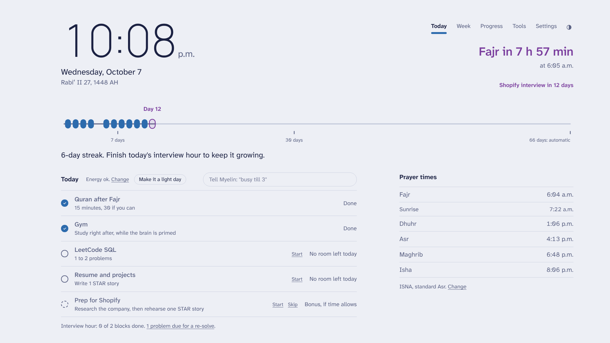
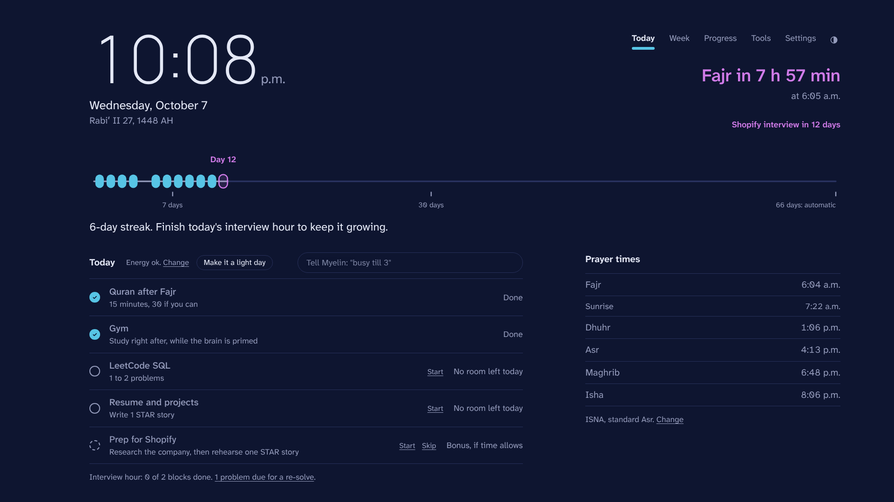
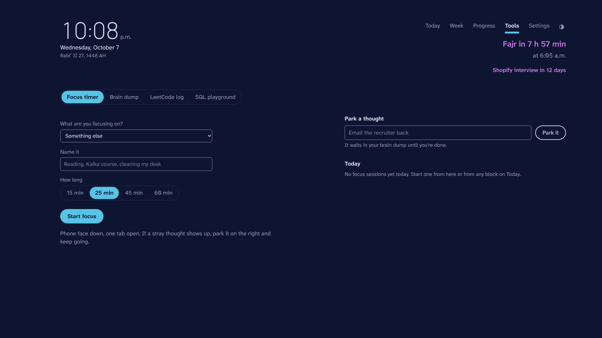
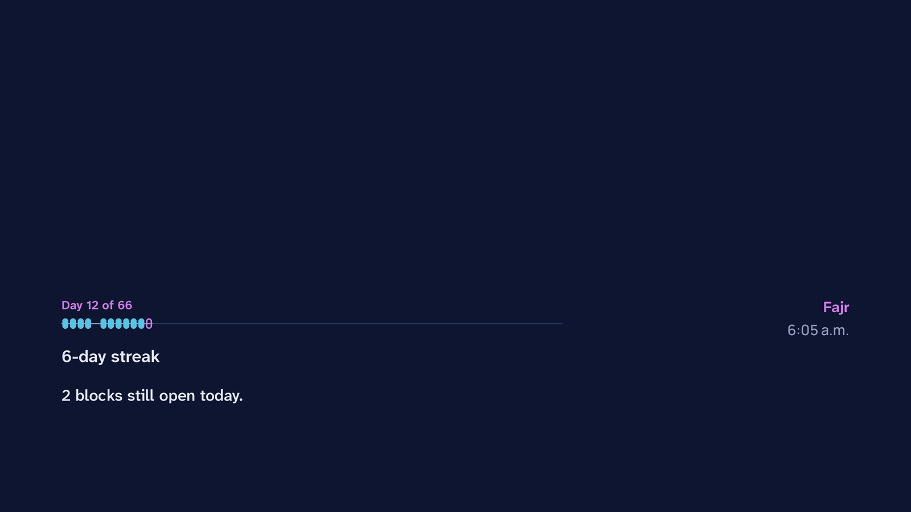
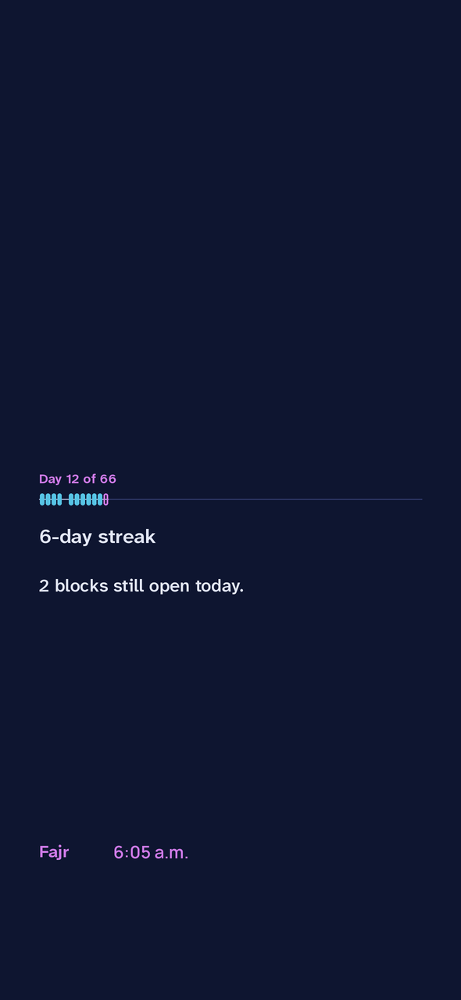

# Myelin

Myelin is a Windows app that plans your day, protects your streak and keeps your prayer times in view. It lives in three places: an app window with a tray icon, your desktop wallpaper, and your lock screens on Windows and iPhone. Every feature is built on what research says actually rewires habits.

Practice wraps nerve pathways in myelin, the insulation that makes signals fire faster. Myelin draws your streak the same way: each day you finish your plan wraps one segment of an axon, across the 66 days habits take on average to become automatic.



After Maghrib it switches to a night view, styled like a fluorescence microscope:



_Screenshots use sample data._

## Install

1. Download **Myelin-Setup** from the [latest release](https://github.com/ahrazkk/myelin/releases/latest) and run it. It installs for your user only, with no admin prompt. Windows may warn that the app is unrecognized, because it isn't code-signed yet; choose **More info**, then **Run anyway**.
2. Myelin opens. In **Settings**, choose **Use my location** so prayer times are right.
3. For the wallpaper, install [Lively Wallpaper](https://github.com/rocksdanister/lively) from the Microsoft Store. Choose **Add wallpaper**, enter `http://127.0.0.1:8765/`, and turn on mouse input for wallpapers in Lively's settings so you can tick things off on the desktop.

Closing the window keeps Myelin in the tray, so the wallpaper, lock screens and reminders keep working. Quit from the tray icon.

## What it does

**Today** builds a timed plan around your work hours, commute, prayers and calendar: Quran right after Fajr, gym, then the interview hour in the window right after exercise. Each block has a Start button for a focus timer.

Tell Myelin about your day in the command box, or press **Ctrl+Alt+M** from anywhere in Windows:

| Type | What happens |
| --- | --- |
| `busy till 3`, `meeting 2-4` | Blocks that time and reshuffles the rest of the day |
| `free 12-1` | Opens a slot, even inside work hours |
| `light day`, `energy low` | Shrinks the first interview block to a 20-minute rescue that still keeps the streak |
| `skip gym` | Drops gym today and re-plans |
| `interview Shopify oct 20` | Adds prep blocks two weeks out and mock interviews three days out |
| `focus 25` | Starts a 25-minute focus timer |
| `note call the bank` | Parks a thought in your brain dump |
| `clear` | Forgets today's busy and free times and turns off light day |

**Week** shows the whole rotation, with finished days wrapped. **Progress** shows your current and best streak, a calendar heatmap, and a small axon per habit counting reps toward 66.

**Tools**
- **Focus timer:** start from any block; a badge follows you across tabs and a chime plays at the end.
- **Brain dump:** park a stray thought mid-focus and clear it later.
- **LeetCode log:** record the link, pattern, outcome and time. Problems come back for a re-solve at +3, +7, +21 and +60 days, and Myelin suggests your weakest pattern.
- **SQL playground:** three sample databases and 18 interview questions with answer checking. Queries run on a throwaway in-memory copy.



**Lock screens.** Neither Windows nor iPhone allows a live app on the lock screen, but both show a picture, so Myelin draws one of your day: day of 66, the streak axon, what's next and the next prayer.

| Windows | iPhone |
| --- | --- |
|  |  |

- **Windows:** turn on *Keep my Windows lock screen up to date* in Settings, under Lock screens. Myelin refreshes it every 15 minutes.
- **iPhone:** turn on phone access in the same section and copy the private link it shows. In the Shortcuts app, create a daily automation: **Get Contents of URL** with that link, then **Set Wallpaper** on the Lock Screen. Add two or three times a day to keep it fresh. Your phone needs to be on the same Wi-Fi as your PC. Only that picture is reachable from your network, and only with the link.

**Settings** covers the theme (Auto switches at Maghrib and sunrise, or choose Light, Dark or Follow Windows, also on the toggle beside the tabs), text size, reduced motion, work hours and office days, commute, prayer method and Asr, private calendar links from Google or Outlook, upcoming interviews, lock screens, reminders and starting with Windows.

**Reminders** come as Windows notifications: 10 minutes before each prayer, when a block starts, and when a focus timer ends.

## Why it works the way it does

| Finding | How Myelin uses it |
| --- | --- |
| Habits took a median of 66 days to become automatic, and one missed day did not derail them ([Lally et al., 2010](https://jamesclear.com/new-habit)). | A 66-day cycle, light days that keep the streak alive, no red for missed days. |
| Interleaving, spacing and retrieval practice are among the best-supported learning strategies ([Weinstein et al., 2018](https://www.ncbi.nlm.nih.gov/pmc/articles/PMC5780548/)). | Two different tracks every day, and LeetCode re-solves on a spaced schedule. |
| A single bout of aerobic exercise primes learning for at least 30 minutes afterward ([study](https://pmc.ncbi.nlm.nih.gov/articles/PMC4857085)). | Study blocks are placed right after gym. |
| If-then plans have a medium-to-large effect on reaching goals ([Gollwitzer & Sheeran](https://kops.uni-konstanz.de/handle/123456789/69905)). | Every habit has an anchor and a time, like Quran right after Fajr. |

## Privacy

Everything runs on your PC: a small local server and one SQLite file in `%LOCALAPPDATA%\Myelin`. There's no account and no cloud. Your location is used only to calculate prayer times, and calendars are read through private links you paste in.

## Change your routine

Tracks, the weekly rotation and gym days live in [`backend/myelin/defaults/routine.json`](backend/myelin/defaults/routine.json). Work hours, office days, commute and the rest are in Settings.

## Develop

```bash
# Server and app (Python 3.11+)
cd backend
python -m venv .venv && source .venv/bin/activate   # Windows: .venv\Scripts\activate
pip install -e ".[dev,desktop]"
pytest
python -m myelin            # server only: http://127.0.0.1:8765
python -m myelin.desktop    # the full app: window, tray, hotkey, reminders

# Web interface (Node 20+), in a second terminal
cd frontend
npm install
npm run dev                 # http://localhost:5173, forwards /api to the server
```

To build the installer locally on Windows: `npm run build` in `frontend`, then `pip install -e "backend[desktop,build]"`, `pyinstaller packaging/myelin.spec`, and compile `packaging/installer.iss` with Inno Setup. Pushing a tag like `v0.2.0` does all of this on GitHub Actions and attaches the installer to a release.

| Folder | What's in it |
| --- | --- |
| `backend/myelin` | FastAPI server, scheduler, commands, streaks, prayer times, lock screens, the desktop app |
| `backend/myelin/routes` | API routes by feature |
| `backend/tests` | pytest suite |
| `frontend/src` | React + TypeScript interface: Today, Week, Progress, Tools, Settings |
| `packaging` | PyInstaller recipe, installer script and icon |
| `scripts` | Run from source on Windows: setup, start, start at sign-in |

## Roadmap

- [x] **Foundations:** server, wallpaper, prayer times, streak axon, Week and Progress
- [x] **Smart planning:** timed schedule, quick commands, light days, energy check-in, interview mode, calendar sync
- [x] **Tools:** focus timer, brain dump, LeetCode log with spaced re-solves, SQL playground
- [x] **Everywhere:** Windows app with tray, hotkey and reminders, installer, themes, Windows and iPhone lock screens
- [ ] **Faith:** daily hadith with labeled AI explanations, Quran khatm progress, dhikr counter
- [ ] **AI:** bring your own AI (Claude, OpenAI, Gemini or local Ollama) to plan, quiz and run mock interviews
- [ ] **For everyone:** setup wizard, routine templates, content packs, wallpaper layout editor

## License

[MIT](LICENSE)
